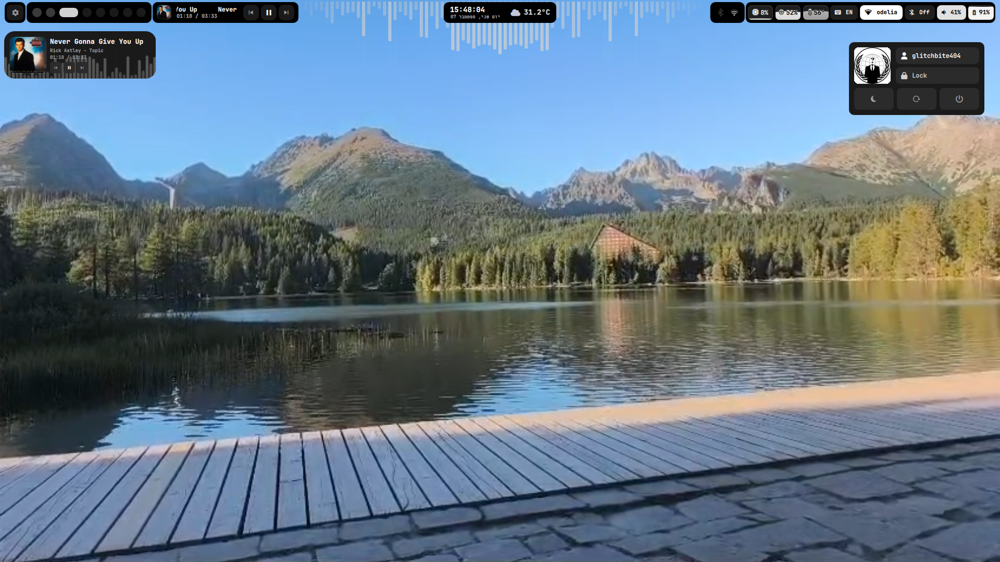

<div align="center">

# ▟▛▜▙ BITE-OS

### `// THE SYSTEM BIT YOU`


**A glitch-themed, performance-obsessed Linux distribution.**
Built on the CachyOS base — riced to the teeth, engineered to never get in your way.

`v1.0` · codename **dedsec** · build `20260906` · by **GLITCH-BITE-404**

[](#-download)
[](https://www.tiktok.com/@glitch_bite404)


[](LICENSE)

**[⤓ Download](#-download)** · **[🛠 Built by hand](BUILT.md)** · **[🐕 Meet Laffy](LAFFY.md)**

</div>

---

> ## ⬛ Latest version — build `20260906`
>
> **This is the newest ISO and replaces every earlier upload.** A wallpaper and
> desktop-stability build: the wallpaper picker **applies the picture you actually
> chose**, **video wallpapers survive a reboot** instead of coming back as a frozen
> frame, and rice switching stopped **stacking duplicate bars and shells** on top of
> each other. Full list under **[What's new](#-whats-new-in-20260906)**.
>
> **[⤓ Download it here](#-download)** · already on an older build? Just press
> `SUPER+U`, no reinstall needed.
>
> After installing, `bite-toys update && bite-toys upgrade` pulls the newest
> toys — they update independently of the ISO.

---

> **TL;DR** — BITE-OS is a glitch-themed Linux distro on a CachyOS/Arch base: a full
> Hyprland rice, **two swappable desktops**, self-healing config, and **one-key system
> updates** — heavy looks, light idle. Grab the [ISO](#-download) and install in minutes.
> Named after my Shiba Inu, [Laffy](LAFFY.md) 🐕.

---

## ◈ Gallery

<!-- Drop your screenshots in assets/screenshots/ with these names (see that
     folder's README). Until then these links just won't render. -->

<div align="center">

| caelestia rice | serpantinum rice |
|:---:|:---:|
|  |  |
| **Glitch dashboard** | **`// THE SYSTEM BIT YOU`** |
|  |  |
| **One-key self-update (`SUPER+U`)** | **Wallpaper / rice picker** |
|  |  |

</div>

---

## ◈ What makes it BITE

BITE-OS isn't a reskin. It ships things stock Arch and CachyOS simply don't have:

> ⚠️ **Developer Note:** Unlike basic rice builds, most of the system UI has been completely reprogrammed, optimized, and natively pre-riced from the ground up for zero-latency execution.

- **🦷 Dot-switch** — two *complete* desktops (`caelestia` + `serpantinum`), swapped with **one keypress**. Every swap auto-backs-up your config, and a 30-second watchdog auto-reverts if anything breaks. You physically cannot get locked out.
- **⚙ Live GUI settings** — keybinds, language, weather, startup apps and dot-switching — all editable from an in-system panel. No text files. Configs recompile and reload instantly.
- **🛠 Self-repair** — a health check runs at every login and rebuilds a wiped config automatically. The OS fixes itself.
- **⬆ One-key update** — `SUPER+U` runs a full system update (kernel, apps, AUR, rice) that **keeps it BITE-OS** — branding is re-asserted on every upgrade, so it never decays into vanilla CachyOS.
- **⚡ Fast** — a full heavy glitch/DEDSEC rice that idles around **5% CPU** and holds **144 fps**. Performance is the whole point.
- **🌐 Keyless weather, glitch borders, animated everything** — and it still doesn't lag.

---

## ◈ Performance Engineering

The rice is heavy on purpose — and it still idles light because the *backend* is
tuned, not the effects stripped. Nothing here costs you a single blur or shader.

**Wallpaper engine (event-driven, single-instance):**
- Video wallpapers hardware-decode via **VAAPI** (`mpvpaper`), not the CPU.
- An auto-pause daemon **freezes the wallpaper (`SIGSTOP`) the instant a window
  goes fullscreen** and resumes it on exit — a fullscreen game/video pays ~0%
  wallpaper cost.
- A `flock` mutex + a `SIGCONT → SIGTERM → SIGKILL` teardown guarantee **exactly
  one wallpaper process** — no matter how fast you spam the dot/wallpaper picker,
  it never stacks "ghost" instances.
- `wall-optimize` ships as a tool: it re-rates any wallpaper video to 24fps
  (lossless to the eye on a loop), cutting decode/composite load **~20–50%**.
  Originals are always backed up, never destroyed.

**Compositor (Hyprland, tuned for mobile iGPU):**
- **Direct scanout + per-window tearing** — fullscreen games/video bypass the
  compositor entirely for lower latency and less GPU work. Only opt-in windows
  tear; the desktop never does.
- **Region damage tracking** (only redraw what changed), **VRR**, and blur passes
  tuned to the sweet spot for integrated graphics.
- Glitch/LARP mode toggles damage tracking around its shaders and **restores the
  exact prior state** on exit — effects are GPU shaders + paced event loops, not
  CPU busy-spinners.

**System base (CachyOS):**
- **zram** (zstd) compressed swap, **`ananicy-cpp`** process auto-prioritization,
  and the CachyOS performance kernel. Governor stays `powersave` — it still
  turbo-boosts under load, without the heat-throttling that *performance* invites
  on a laptop.

**Result:** a full glitch/DEDSEC rice that idles around **5–7% with a live video
wallpaper** (lower still on a static one) and holds **144 fps**.

---

## ◈ Does it match your vibe?

If your taste runs **cyber / glitch / DEDSEC-hacker** — neon-on-black, terminals that
look like a breach in progress, fangs in the logo, animated everything — BITE-OS is
built to feel like that **the second it boots**, no hours of ricing required. And if
your vibe is something else entirely, it bends: two complete desktops, a live theming
engine, and a rice vault mean you can reshape it into *yours* and never get locked out.
It's opinionated out of the box, infinitely yours after.

---

## ◈ Hand-built tooling

None of this is borrowed — it was written *for* BITE-OS. *(Full writeup: [`BUILT.md`](BUILT.md).)*

- **`glitch-fetch`** — a from-scratch fastfetch rewrite, built as a **pure-Bash "gacha"
  engine**: every time you open a terminal it rolls a **random logo** (Laffy, the BITE
  fangs, glitch art), **auto-detects that image's aspect ratio**, and renders it into a
  matching framed layout (centered / side-by-side / vertical) with a boxed, glyph-framed
  system readout. Per-shell caching keeps each session's pick stable. No two terminals
  look the same.
- **`rice`** — the **rice vault**: `rice save` / `load` / `rollback`. Snapshots your
  *entire* desktop, auto-backs-up before every swap, and reverts in one command. Your
  setup is a versioned artifact, not fragile dotfiles you pray over.
- **Dot-switch + watchdog** — flip between the two desktops with one key; a 30-second
  watchdog **auto-reverts if a swap breaks**. You physically cannot lock yourself out.
- **`bite-os-update` (`SUPER+U`)** — one-key full update (kernel / apps / AUR / rice)
  that **re-asserts branding** every time, so updates never decay it back to vanilla
  CachyOS. Optional, logged, asks first.
- **Self-heal** — a login healthcheck quietly rebuilds a wiped config. The OS fixes itself.
- **Glitch mode (`SUPER+B`)** — a LARP overlay: glitch shader, dedsec wallpaper, amber
  trace HUD and paced popups — engages and tears down cleanly, restoring your exact state.
- **Wallpaper engine** — single-instance VAAPI video wallpapers, an auto-pause daemon, a
  ghost-reaper so it never stacks, and `wall-optimize` to down-rate any wallpaper for
  lower idle CPU.
- **`bite-toys`** — a little **package manager for the fun stuff**. Browse, install,
  configure and remove toys from a five-tab TUI. A toy is just a directory, settings
  reach it as `TOY_*` env vars, and every downloaded tarball is checked against a
  published sha256 before it's unpacked. Ships with six — the full catalog,
  screenshots and docs live in
  **[BITE-OS-toys](https://github.com/GLITCH-BITE-404/BITE-OS-toys)**.

---

## ◈ Toys

BITE-OS ships **`bite-toys`** — a little package manager for the fun half of the
system. Run it with no arguments for the hub, or use any toy as a plain command.
Six come preinstalled, and any of them is two keypresses from gone.

> ### ▶ **[BITE-OS-toys →](https://github.com/GLITCH-BITE-404/BITE-OS-toys)**
> Every toy, what it does, screenshots of each one, and how to write your own.
> That repo is also the live catalog — `bite-toys update` pulls from it, so new
> toys and fixes arrive without reinstalling anything.

`bitecam` · `bitemask` · `bitebeat` · `bitemuseum` · `biteglyph ⚙` · `bitedig ⚙`

Heavy dependencies are **on demand** — the hub offers the `pacman` install the
first time a toy needs one, so nothing bloats the ISO. Architecture writeup in
[`BUILT.md`](BUILT.md).

---

## ◈ Custom Keybinds Matrix

The system maps directly to these custom core inputs for elite navigation:

| Keybinding | Action | Execution Target |
|---|---|---|
| `SUPER + B` | **Hacker Aesthetic Overlay** | Triggers the "LARP" mode for full system cyber visual effects |
| `SUPER + T` | **Open Terminal** | Launches the pre-configured terminal environment instantly |
| `SUPER + Q` | **Close Window** | Safely terminates the active focused window |
| `SUPER + ALT + SPACE` | **Toggle Floating Mode** | Forces the active window into a floating layer |
| `CTRL + SUPER + D` | **Hot-Swap Rice** | Toggles between the `caelestia` and `serpantinum` dots profiles |
| `SUPER + BACKSPACE` | **Hot-Swap Rice** | Same toggle — works from either rice |
| `SUPER + ESCAPE` | **Hot-Swap Rice** | Same toggle — works from either rice |
| `CTRL + ALT + BACKSPACE` | **Hot-Swap Rice** | Same toggle — works from either rice |
| `SUPER + SHIFT + C` | **Force Caelestia** | Jumps straight back to the `caelestia` dots profile from anywhere |
| `SUPER + R` | **Reload Waybar** | Instantly recompiles and hot-reloads the Waybar panel |
| `SUPER + U` | **Update BITE-OS** | Full system update (kernel, apps, rice) with logs — stays BITE-OS |

---

## ◈ Download

> ### ⬛ Latest build — `20260906`
> This is the **current** ISO and supersedes every earlier upload. Everything from
> the `20260903` build plus a wallpaper and desktop-stability pass — see
> **[What's new](#-whats-new-in-20260906)**. If you're already running BITE-OS, most
> of these reach you with `SUPER+U`; the first-boot and installer fixes need this ISO.

> The ISO (~5.5 GiB) is hosted off-GitHub due to file-size limits.

**➡ [Download BITE-OS 1.0 (dedsec)](https://archive.org/download/bite-os-1.0-x86_64_20260906/bite-os-1.0-x86_64.iso)**

*(mirror / details page: [archive.org item](https://archive.org/details/bite-os-1.0-x86_64_20260906))*

`SHA256`: `f8b867cef6816e06af0b54ce92934c8ff0fb2c0869cda30db12ce69ba43c2bc8`

Verify the download before flashing — anything that doesn't match this hash is not the ISO I built:

```bash
sha256sum bite-os-1.0-x86_64.iso
```

This build ships **`bite-toys`** and its four toys preinstalled — see [Toys](#-toys).

## ◈ What's new in 20260906

A wallpaper and desktop-stability build. Nothing was redesigned — things that had
been quietly broken for a while now work.

**The wallpaper picker applies the picture you pick.** Arch renamed the `swww`
package to `awww`, and the picker was still calling `swww`. Because it kills the
video wallpaper *before* painting the new one, choosing an image killed your video
and then painted nothing — leaving whatever was on screen before, which looked like
the picker ignoring you and reverting to the default. Every call now targets `awww`.

**Video wallpapers survive a reboot.** The picker caches a still thumbnail for
videos, so nothing on disk remembered the actual video path and every boot restored
a frozen frame that only came alive if you re-picked it. The real source path is now
recorded and replayed, so a video comes back as a video.

**Video wallpapers stop duplicating.** Tearing down `mpvpaper` sent `SIGTERM` and
immediately spawned a replacement without waiting, so the old process could outlive
the new one. Worse, a paused (`SIGSTOP`ped) wallpaper can never act on `SIGTERM` at
all, so it became an unkillable ghost. Teardown is now resume → terminate → wait →
kill, and rapid clicks queue instead of stacking.

**Switching rices stops stacking bars and shells.** The settings watcher had no
single-instance guard and regenerated `autostart.conf` in place, so two copies could
interleave and write every startup entry *twice* — including the shell and the
watcher itself. Each login then started two of each, which doubled the file again:
a compounding loop that ended in several bars drawn over each other. The watcher is
now single-instance and generates the file atomically.

**Spamming the rice-swap bind is safe.** Every press used to run a full concurrent
swap, with kills racing launches. Swapping is now single-instance, waits for the new
shell to actually paint rather than merely exist, and settles before releasing — so
extra presses are dropped instead of melting the session. The `toggle` binds also
resolve directly instead of re-invoking the script.

**The swap chord no longer opens the launcher on top of you.** Caelestia opens its
launcher on Super *release* unless a suppression flag is set — but that flag lives in
the shell process, so killing the shell mid-chord reset it. Releasing Super after a
swap then looked like a bare Super tap and opened a full-screen blurred drawer that
grabbed input. The flag is re-armed on the fresh shell.

## ◈ What's new in 20260903

A bug-fix build. Nothing was redesigned — things that were quietly broken now work.

**Weather actually shows the weather.** The top bar, lock screen and calendar sat on
`--°` regardless of conditions. Two faults stacked: half the weather icons had lost
their nerd-font glyphs, and the parser called `.trim()` on the whole response before
splitting it, so a blank icon line shifted every field out of place and the reading was
discarded. Both fixed — and it no longer depends on an API key at all.

**You can choose which user to log in as.** The greeter was locked to the last account
that logged in, with no way to switch. Click the username (or press ↑/↓) to cycle
accounts. Single-user installs look and behave exactly as before.

**Lock screen: Switch User.** New entry in the power menu. It hands off to the display
manager, so your session stays locked and intact behind the new greeter.

**Keyboard layouts stopped eating themselves.** Adding a language could silently append
a duplicate and leave a malformed entry that broke layout switching. The layout list is
now normalised everywhere it's read or written.

**Blank icons fixed.** Some system apps showed a placeholder square instead of an icon —
it looked random but was deterministic: the rice sets `QT_QPA_PLATFORMTHEME=qt6ct`, and
with no qt6ct config present Qt was handed no icon theme at all, so every generic icon
name failed to resolve. Fresh installs now ship a correct config, and **`bite-icons-fix`**
repairs it on an existing system (`bite-icons-fix --check` to inspect without changing
anything).

**A fresh install now boots with a top bar.** First-boot autostart launched the popup
overlay instead of the shell entrypoint, so a brand-new install came up with no bar and
no floating widgets until something restarted the shell.

**caelestia rice: the browser key works.** It pointed at a browser that isn't installed,
so the bind did nothing. It opens Firefox now.

Links and credits across the project now point at **GLITCH-BITE-404** and the GitHub
repo; the old handle's URLs were dead.

## ◈ Install

1. Flash the ISO to a USB (≥ 8 GB) with [Impression](https://apps.gnome.org/Impression/), [Ventoy](https://www.ventoy.net/), or `dd`.
2. Boot it. The live ISO comes up **straight into the full BITE-OS desktop** — the real rice, running live — with the installer opening on top of it. Try the dots before you commit.
3. Click through the installer: language → keyboard → disk → *your* username + password → **Install** (re-open it anytime from the app launcher: *Install BITE-OS*).
4. Reboot into your own riced BITE-OS — the same desktop you just test-drove, now yours.
5. *(optional)* `bite-toys update && bite-toys upgrade` — the toys ship on the ISO but
   update independently of it, so this pulls anything newer than the image you flashed.

No terminal required, no desktop to pick — BITE-OS installs as **one opinionated, pre-riced Hyprland system**, offline (no internet needed during install).

## ◈ Updating

BITE-OS keeps itself current **and stays BITE-OS** — updates never revert it to vanilla CachyOS.

- Press **`SUPER + U`**, or launch **Update BITE-OS** from the app menu, or run **`bite-os-update`** in a terminal.
- It updates *everything* (kernel, apps, AUR, the rice), is **optional** (asks first, only acts if there's something to do), and **logs** every run to `~/.local/state/bite-os/`.

## ◈ Source

The core engineered logic — dot-switch + watchdog, self-repair, the live
settings engine, the rice vault — lives in **[`src/`](src/)**, readable and
auditable with no build step. See [`src/README.md`](src/README.md) for the map.

## ◈ Packages & updates

BITE-OS is delivered as a **native pacman package** (`bite-os`) served from its
own **`[bite-os]` repo** — so the whole system (rices, themes, dot-switch engine,
glitch tooling, branding) updates the Arch-native way:

```bash
sudo pacman -Syu          # pull the latest BITE-OS alongside CachyOS/Arch updates
```

The `bite-os` package stages the rice vault and tooling into `/etc/skel`, so
every fresh install boots fully riced. Branding is pinned by `zz-bite-os-*`
pacman hooks that re-assert on every upgrade — system updates can't wash the
identity out.

The `[bite-os]` repo is **live**, hosted on GitHub Releases, and wired into
`/etc/pacman.conf` automatically on install — so `SUPER+U` / `pacman -Syu`
pulls new BITE-OS releases straight from this repository.

## ◈ Build it yourself

BITE-OS is assembled from this repo on an Arch / CachyOS host:

```bash
bash repo/build-repo.sh        # build the bite-os package + local repo
sudo pacman -S --needed archiso
sudo bash build-iso.sh         # build the ISO -> out/
```

This builds **BITE-OS itself** (not a "make your own distro" template) — the rices,
themes and tooling are all committed, so a **fresh clone builds the full ISO**. You'll
need an Arch / CachyOS host with `paru` (it fetches the AUR dependencies during
`build-repo.sh`). Most people should just grab the [ISO](#-download) above — building is
for tinkerers who want to rebuild or fork it.

## ◈ License & Credit

BITE-OS is © 2026 **GLITCH-BITE-404** and released under the **GNU General Public
License v3.0** ([`LICENSE`](LICENSE)). In short: you're free to use, study, share
and modify it — but **if you copy, fork, remix or redistribute BITE-OS you must
credit the author (GLITCH-BITE-404), link back to this repo, keep your version
open-source under the same license, and not pass your fork off as the official
BITE-OS.** Full terms and the attribution requirements are in [`NOTICE`](NOTICE).

The bundled upstream packages (Hyprland, CachyOS base, Calamares, caelestia,
fonts, …) keep their own respective licenses.

---

<div align="center">

`// THE SYSTEM BIT YOU` — built by **GLITCH-BITE-404**

🐕 *Named after, and built for, a Shiba Inu named Laffy — [meet him](LAFFY.md).*

</div>
